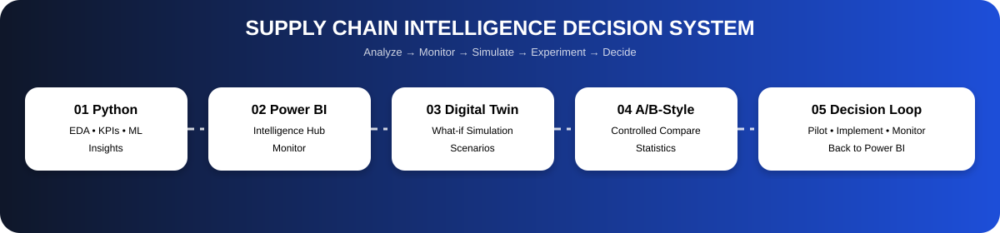
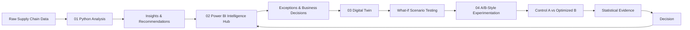

# 🚚 Supply Chain Intelligence Decision System

<p align="center"></p>

<p align="center"><b>Python Analysis → Power BI Intelligence Hub → Digital Twin → A/B-Style Experimentation → Decision</b></p>

## 🎯 Project Objective

This is one connected supply-chain analytics and decision system, not four disconnected projects.

**Analyze → Monitor → Simulate → Experiment → Decide → Monitor**

## 🧠 Architecture



## 📁 Repository Structure

```text
Supply-Chain-Intelligence-Decision-System/
├── 01_Python_Analysis/
│   └── Supply_Chain_Intelligence_Hub.ipynb
├── 02_Intelligence_Hub_PowerBI/
│   └── Supply_Chain_Intelligence_Hub.pbix
├── 03_Digital_Twin/
│   └── Supply_Chain_Digital_Twin_Simulation_Pipeline.ipynb
├── 04_AB_Experimentation/
│   └── Supply_Chain_AB_Experimentation.ipynb
├── 05_Documentation/
│   ├── architecture.svg
│   ├── DATA_FLOW.md
│   └── validation_report.md
├── scripts/
│   └── validate_project.py
├── requirements.txt
├── .gitignore
└── README.md
```

## 1️⃣ Python Analysis

The supplied `Supply Chain Intelligence Hub` notebook covers data loading, cleaning, feature engineering, exploratory analysis, KPI computation, ML-ready processing, profitability, inventory health, supplier performance, logistics analysis, insights, recommendations, and Power BI-ready outputs.

## 2️⃣ Supply Chain Intelligence Hub — Power BI

The supplied PBIX is preserved as the dashboard layer. Its role is to turn analytical outputs into an interactive management view for executive KPIs, inventory, suppliers, logistics, profitability, and exceptions.

## 3️⃣ Digital Twin

The supplied `Supply Chain Digital Twin Simulation Pipeline` notebook builds a one-year simulated supply chain with products, warehouses, suppliers, orders, shipments, daily inventory and KPI outputs.

It also contains an audit/validation stage for generated data, keys, referential integrity, inventory, shipments, KPIs, SQL-friendly outputs, and data dictionary quality.

The supplied notebook's recorded readiness result is **100/100**.

## 4️⃣ A/B-Style Experimentation

The added notebook compares:

- **A — Control:** baseline/current strategy
- **B — Treatment:** insight-driven optimized strategy

It evaluates simulated outcomes such as fill rate, profit and inventory turnover using repeated controlled simulation and statistical testing.

> **Important:** This is A/B-style controlled simulation, not a claim of a real-world randomized A/B experiment.

## 🔄 Example Decision Loop

```text
Python finds low inventory health
          ↓
Power BI highlights the exception
          ↓
Business proposes improved replenishment
          ↓
Digital Twin simulates the policy
          ↓
A/B-style comparison: A vs B
          ↓
Statistical evidence + guardrails
          ↓
Pilot / Implement / Retest
          ↓
Power BI monitors the result
```

## 🛠️ Technology Stack

Python • Pandas • NumPy • SciPy • Scikit-learn • Matplotlib • Seaborn • Jupyter • Power BI • CSV • Statistical Testing • Supply Chain Simulation

## ▶️ Execution Order

1. Run `01_Python_Analysis/Supply_Chain_Intelligence_Hub.ipynb`
2. Review `02_Intelligence_Hub_PowerBI/Supply_Chain_Intelligence_Hub.pbix`
3. Run `03_Digital_Twin/Supply_Chain_Digital_Twin_Simulation_Pipeline.ipynb`
4. Run `04_AB_Experimentation/Supply_Chain_AB_Experimentation.ipynb`
5. Select **Pilot / Implement / Retest**
6. Return to Power BI for monitoring

## 📊 Portfolio Value

This demonstrates descriptive analytics, diagnostic analytics, predictive/ML analysis, business intelligence, decision intelligence, supply-chain simulation, what-if analysis, statistical experimentation, and data-driven decision making.

Relevant roles include **Data Analyst, Business Analyst, Supply Chain Analyst, Operations Analyst, Product Analyst, and Analytics/Decision Science roles**.

## ⚠️ Experimentation Disclaimer

A real A/B test requires randomized assignment, exposure logging, sample-size/power planning, predefined primary metrics, interference controls, and real operational observations. The current A/B layer is controlled simulation and should be presented honestly as such.
